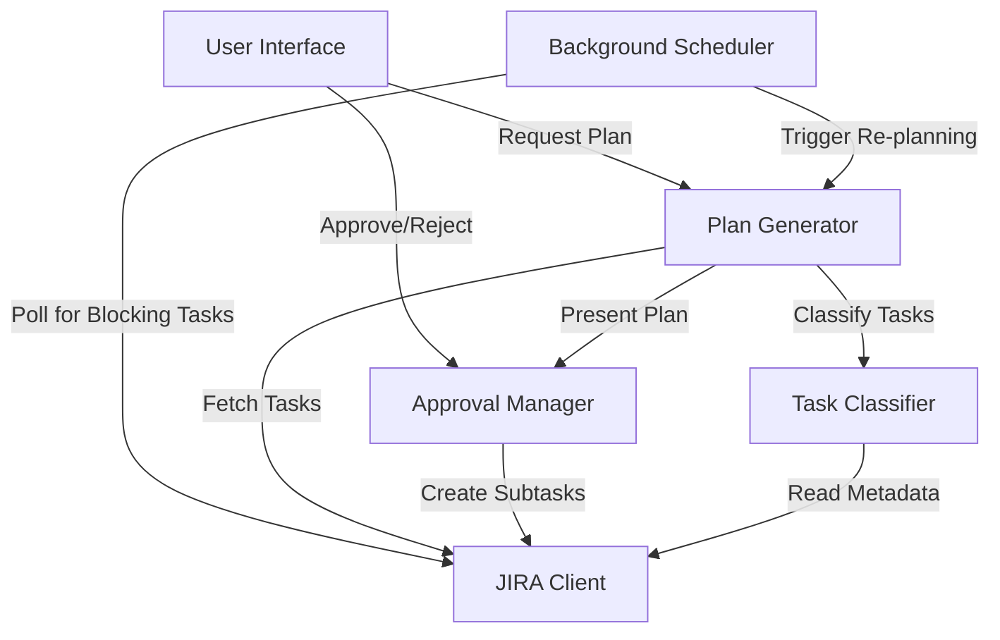

# Design Document: AI Secretary

## Overview

The AI Secretary is an asynchronous execution support system designed to reduce cognitive load for senior technical professionals working in high-interruption environments. The system operates on a simple principle: JIRA is the single source of truth, and all planning happens asynchronously with explicit human approval.

User Interface refers to any minimal interaction mechanism (CLI, file-based output, notification-based, or similar). No graphical or real-time UI is assumed in v1.

### Core Design Principles

1. **JIRA as Single Source of Truth**: No persistent local state beyond the current session. All task data lives in JIRA.
2. **Asynchronous Operation**: Background polling and plan generation without blocking the user.
3. **Human Control**: Every plan and decomposition requires explicit approval before execution.
4. **Cognitive Load Minimization**: Maximum 3 priorities per day, grouped administrative tasks, concise outputs.
5. **Daily Closure Focus**: All priority tasks must be closable within one working day.

### Key Workflows

1. **Daily Plan Generation**: Fetch tasks from JIRA → Classify → Select up to 3 priorities → Present for approval
2. **Blocking Task Interruption**: Detect blocking task → Mark current plan interrupted → Generate new plan → Request approval
3. **Long-Running Task Decomposition**: Identify multi-day task → Propose daily-closable subtasks → Request approval → Create in JIRA
4. **Administrative Task Grouping**: Classify admin tasks → Group into 90-minute blocks → Schedule during low-energy periods

## Architecture

### System Components



### Component Responsibilities

**JIRA Client**
- Authenticate with JIRA REST API (API token or OAuth)
- Execute JQL queries to fetch tasks
- Create subtasks with proper linking
- Update task status and metadata
- Handle API errors and rate limiting

**Task Classifier**
- Parse task metadata (labels, custom fields, issue links)
- Identify third-party dependencies from issue links
- Estimate effort from story points or time tracking
- Categorize tasks (priority-eligible, administrative, long-running, blocking)
- Normalize task data into internal representation

**Plan Generator**
- Fetch all active tasks via JIRA Client
- Apply classification via Task Classifier
- Select up to 3 priority tasks (no dependencies, closable in one day)
- Group administrative tasks into time blocks
- Format output as structured markdown
- Track previous day's closure rate

**Background Scheduler**
- Poll JIRA at configurable intervals (default: 15 minutes)
- Detect newly marked blocking tasks
- Trigger re-planning flow when blocking tasks detected
- Queue operations by priority (blocking tasks first)
- Provide status updates for long-running operations

**Approval Manager**
- Present plans and proposals to user
- Collect explicit approval or rejection
- Handle user modifications to proposals
- Request feedback on rejections
- Coordinate with JIRA Client to execute approved actions

### Data Flow

**Daily Plan Generation Flow**:
1. User requests daily plan (or scheduler triggers at configured time)
2. Plan Generator requests all active tasks from JIRA Client
3. JIRA Client executes JQL query: `assignee = currentUser() AND resolution = Unresolved`
4. Task Classifier processes each task to determine eligibility
5. Plan Generator selects up to 3 priority tasks and groups admin tasks
6. Approval Manager presents plan to user
7. On approval, plan is finalized; on rejection, user provides feedback and new plan is generated

**Blocking Task Interruption Flow**:
1. Background Scheduler polls JIRA for tasks with blocking priority
2. If blocking task detected, scheduler marks current plan as interrupted
3. Scheduler triggers Plan Generator with blocking task context
4. Plan Generator creates new plan incorporating blocking task
5. Approval Manager notifies user and requests approval
6. On approval, new plan replaces current plan

## Components and Interfaces

### JIRA Client Interface

```python
class JiraClient:
    """
    Handles all communication with JIRA REST API.
    Uses API token authentication for simplicity and security.
    """
    
    def __init__(self, base_url: str, email: str, api_token: str):
        """
        Initialize JIRA client with authentication credentials.
        
        Args:
            base_url: JIRA instance URL (e.g., https://company.atlassian.net)
            email: User email for authentication
            api_token: API token generated from JIRA account settings
        """
        pass
    
    def fetch_active_tasks(self) -> List[JiraIssue]:
        """
        Fetch all unresolved tasks assigned to current user.
        
        Returns:
            List of JiraIssue objects with full metadata
            
        Raises:
            JiraConnectionError: If JIRA is unavailable
            JiraAuthError: If authentication fails
        """
        pass
    
    def fetch_blocking_tasks(self) -> List[JiraIssue]:
        """
        Fetch tasks marked with blocking priority.
        
        Uses JQL: assignee = currentUser() AND priority = Blocker AND resolution = Unresolved
        
        Returns:
            List of blocking JiraIssue objects
        """
        pass
    
    def create_subtask(self, parent_key: str, subtask: SubtaskSpec) -> str:
        """
        Create a subtask under a parent issue.
        
        Args:
            parent_key: JIRA key of parent issue (e.g., PROJ-123)
            subtask: Subtask specification with title, description, estimate
            
        Returns:
            JIRA key of created subtask
        """
        pass
    
    def update_task_status(self, task_key: str, status: str) -> None:
        """
        Update task status (e.g., mark as completed).

        This method MUST only be used to reflect explicit, user-approved actions (e.g., subtask creation workflows). The system MUST NOT infer or autonomously update task completion status.
        
        Args:
            task_key: JIRA key of task
            status: Target status (e.g., "Done", "In Progress")
        """
        pass
```

### Task Classifier Interface

```python
class TaskClassifier:
    """
    Classifies tasks based on metadata and determines eligibility for priority status.
    """
    
    def classify_task(self, issue: JiraIssue) -> TaskClassification:
        """
        Classify a single task.
        
        Args:
            issue: Raw JIRA issue with metadata
            
        Returns:
            TaskClassification with category, eligibility, and metadata
        """
        pass
    
    def has_third_party_dependencies(self, issue: JiraIssue) -> bool:
        """
        Check if task has dependencies on external parties.
        
        Examines issue links for "blocks", "is blocked by" relationships
        and custom fields indicating external dependencies.
        
        Returns:
            True if task has third-party dependencies
        """
        pass
    
    def estimate_effort_days(self, issue: JiraIssue) -> float:
        """
        Estimate effort in working days.
        
        Uses story points (if available) or time tracking estimates.
        When estimates are ambiguous or derived from story points, the system must use a conservative default (≥ 1 day) and treat the task as non-priority eligible unless explicitly confirmed otherwise.
        
        Returns:
            Estimated effort in days
        """
        pass
    
    def is_administrative(self, issue: JiraIssue) -> bool:
        """
        Determine if task is administrative (low cognitive load).
        
        Checks for labels like "admin", "email", "report", "approval"
        or issue types like "Administrative Task".
        
        Returns:
            True if task is administrative
        """
        pass
```

### Plan Generator Interface

```python
class PlanGenerator:
    """
    Generates daily plans with up to 3 priorities and grouped admin tasks.
    """
    
    def __init__(self, jira_client: JiraClient, classifier: TaskClassifier):
        pass
    
    def generate_daily_plan(self, previous_closure_rate: Optional[float] = None) -> DailyPlan:
        """
        Generate a daily plan from current JIRA state.
        
        Args:
            previous_closure_rate: Closure rate from previous day (0.0-1.0)
            
        Returns:
            DailyPlan with up to 3 priorities and admin block
        """
        pass
    
    def generate_replan(self, blocking_task: JiraIssue, current_plan: DailyPlan) -> DailyPlan:
        """
        Generate new plan incorporating a blocking task.
        
        Args:
            blocking_task: The blocking task that triggered re-planning
            current_plan: Current plan being interrupted
            
        Returns:
            New DailyPlan with blocking task as priority
        """
        pass
    
    def propose_decomposition(self, long_running_task: JiraIssue) -> List[SubtaskSpec]:
        """
        Propose decomposition of multi-day task into daily-closable subtasks.
        
        Args:
            long_running_task: Task estimated to take > 1 day
            
        Returns:
            List of proposed subtasks, each closable in one day
        """
        pass
```

### Background Scheduler Interface

```python
class BackgroundScheduler:
    """
    Manages asynchronous operations and polling.
    """
    
    def __init__(self, jira_client: JiraClient, plan_generator: PlanGenerator, 
                 poll_interval_minutes: int = 15):
        pass
    
    def start(self) -> None:
        """
        Start background polling for blocking tasks.
        Runs in separate thread/process.
        """
        pass
    
    def stop(self) -> None:
        """
        Stop background polling gracefully.
        """
        pass
    
    def schedule_daily_plan(self, time_of_day: str) -> None:
        """
        Schedule automatic daily plan generation.
        
        Args:
            time_of_day: Time in HH:MM format (e.g., "08:00")
        """
        pass
```

### Approval Manager Interface

```python
class ApprovalManager:
    """
    Handles user interaction for approvals and feedback.
    """
    
    def present_plan(self, plan: DailyPlan) -> ApprovalResult:
        """
        Present plan to user and wait for approval.
        
        Args:
            plan: Daily plan to present
            
        Returns:
            ApprovalResult with approval status and optional feedback
        """
        pass
    
    def present_decomposition(self, parent_task: JiraIssue, 
                            subtasks: List[SubtaskSpec]) -> ApprovalResult:
        """
        Present task decomposition proposal to user.
        
        Args:
            parent_task: Original long-running task
            subtasks: Proposed subtasks
            
        Returns:
            ApprovalResult with approval status and optional modifications
        """
        pass
    
    def notify_blocking_task(self, blocking_task: JiraIssue, new_plan: DailyPlan) -> ApprovalResult:
        """
        Notify user of blocking task and present new plan.
        
        Args:
            blocking_task: The blocking task detected
            new_plan: Proposed new plan
            
        Returns:
            ApprovalResult with approval status
        """
        pass
```

## Data Models

### Core Data Structures

```python
@dataclass
class JiraIssue:
    """Raw JIRA issue data."""
    key: str                    # e.g., "PROJ-123"
    summary: str                # Task title
    description: str            # Task description
    issue_type: str             # e.g., "Story", "Bug", "Task"
    priority: str               # e.g., "High", "Blocker"
    status: str                 # e.g., "To Do", "In Progress"
    assignee: str               # User email or username
    story_points: Optional[int] # Story point estimate
    time_estimate: Optional[int] # Time estimate in seconds
    labels: List[str]           # Task labels
    issue_links: List[IssueLink] # Links to other issues
    custom_fields: Dict[str, Any] # Custom field values

@dataclass
class IssueLink:
    """Represents a link between JIRA issues."""
    link_type: str              # e.g., "blocks", "is blocked by"
    target_key: str             # Key of linked issue
    target_summary: str         # Summary of linked issue

@dataclass
class TaskClassification:
    """Classification result for a task."""
    task: JiraIssue
    category: TaskCategory      # PRIORITY_ELIGIBLE, ADMINISTRATIVE, LONG_RUNNING, BLOCKING
    is_priority_eligible: bool  # Can be a daily priority
    has_dependencies: bool      # Has third-party dependencies
    estimated_days: float       # Effort estimate in days
    blocking_reason: Optional[str] # Why task is blocking (if applicable)

class TaskCategory(Enum):
    PRIORITY_ELIGIBLE = "priority_eligible"
    ADMINISTRATIVE = "administrative"
    LONG_RUNNING = "long_running"
    BLOCKING = "blocking"
    DEPENDENT = "dependent"     # Has third-party dependencies

@dataclass
class DailyPlan:
    """A daily execution plan."""
    date: datetime.date
    priorities: List[TaskClassification]  # Max 3 tasks
    admin_block: AdminBlock
    other_tasks: List[TaskClassification] # Non-priority tasks for reference
    previous_closure_rate: Optional[float] # Previous day's closure rate
    
    def to_markdown(self) -> str:
        """Format plan as structured markdown."""
        pass

@dataclass
class AdminBlock:
    """Grouped administrative tasks."""
    tasks: List[TaskClassification]
    time_allocation_minutes: int  # Max 90 minutes
    scheduled_time: str           # e.g., "14:00-15:30" (post-lunch)

@dataclass
class SubtaskSpec:
    """Specification for creating a subtask."""
    summary: str
    description: str
    estimated_days: float        # Must be <= 1.0
    order: int                   # Sequence order

@dataclass
class ApprovalResult:
    """Result of user approval interaction."""
    approved: bool
    feedback: Optional[str]      # User feedback if rejected
    modifications: Optional[Dict[str, Any]] # User modifications to proposal
```

### Task Selection Algorithm

The Plan Generator uses the following algorithm to select priority tasks:

1. **Filter Eligible Tasks**:
   - Exclude tasks with `has_dependencies = True`
   - Exclude tasks with `estimated_days > 1.0`
   - Exclude tasks with `category = ADMINISTRATIVE`
   - Exclude tasks with `category = BLOCKING` (unless in re-planning flow)

2. **Rank Remaining Tasks**:
   - Sort by priority (Blocker > High > Medium > Low)
   - Within same priority, sort by estimated effort (smaller first)
   - Within same effort, sort by age (older first)

3. **Select Top 3**:
   - Take top 3 tasks from ranked list
   - If fewer than 3 eligible tasks exist, select all available

4. **Group Administrative Tasks**:
   - Collect all tasks with `category = ADMINISTRATIVE`
   - Limit to 90 minutes total (based on estimates)
   - Defer overflow to next day

### Markdown Output Format

```markdown
# Daily Plan - [Date]

## Previous Day
- Closure Rate: [X/Y tasks completed] ([percentage]%)

## Today's Priorities

1. **[PROJ-123] Task Title**
   - Effort: [X] hours
   - Type: [Story/Bug/Task]
   - Notes: [Any relevant context]

2. **[PROJ-124] Another Task**
   - Effort: [X] hours
   - Type: [Story/Bug/Task]

3. **[PROJ-125] Third Task**
   - Effort: [X] hours
   - Type: [Story/Bug/Task]

## Administrative Block (14:00-15:30)

- [ ] [PROJ-126] Email responses
- [ ] [PROJ-127] Weekly report
- [ ] [PROJ-128] Code review approvals

## Other Active Tasks (For Reference)

- [PROJ-129] Waiting on external team (blocked)
- [PROJ-130] Multi-day feature (decomposition needed)
```


## Error Handling

### JIRA API Errors

**Connection Failures**:
- Detect network timeouts and connection errors
- Notify user that JIRA is unavailable
- Defer all planning operations until connectivity restored
- Do not cache stale data or attempt to work offline

**Authentication Errors**:
- Detect 401/403 responses from JIRA API
- Notify user that credentials are invalid or expired
- Provide clear instructions for updating API token
- Halt all operations until authentication resolved

**Rate Limiting**:
- Detect 429 responses from JIRA API
- Implement exponential backoff with jitter
- Respect `Retry-After` header if provided
- Queue operations and retry after rate limit window

**Invalid JQL Queries**:
- Validate JQL syntax before sending to API
- Handle 400 responses with clear error messages
- Log malformed queries for debugging
- Fall back to simpler queries if complex ones fail

### Task Classification Errors

**Missing Metadata**:
- Handle tasks with no story points or time estimates
- Use conservative default (1 day) for unknown effort
- Log tasks with missing metadata for user review
- Continue classification with available data

**Ambiguous Dependencies**:
- When dependency status is unclear, mark as dependent (conservative)
- Notify user of ambiguous cases in plan notes
- Allow user to override classification if needed

**Invalid Task States**:
- Handle tasks in unexpected states (e.g., closed but unresolved)
- Log anomalies for user review
- Exclude from planning to avoid confusion

### User Interaction Errors

**Approval Timeout**:
- If user doesn't respond to approval request within configurable timeout (default: 24 hours)
- Mark proposal as expired
- Do not execute any actions without explicit approval
- Notify user that new approval is needed
- An expired approval does not discard the proposal. Expired proposals may be re-presented or regenerated upon the next user interaction.

**Invalid User Modifications**:
- Validate user modifications to proposals
- Reject modifications that violate constraints (e.g., >3 priorities)
- Provide clear feedback on why modification was rejected
- Request corrected input

### Background Scheduler Errors

**Polling Failures**:
- Log polling errors but continue scheduler operation
- Implement circuit breaker pattern: after N consecutive failures, increase polling interval
- Notify user if polling has been degraded
- Resume normal polling when connectivity restored

**Concurrent Operation Conflicts**:
- Prevent multiple plan generations from running simultaneously
- Queue operations and process sequentially
- Provide status updates if operations are queued

## Testing Strategy

### Unit Testing

The system will use a combination of unit tests and property-based tests to ensure correctness.

**Unit Test Focus Areas**:
- JIRA API response parsing and error handling
- Task classification logic with specific examples
- Markdown formatting and output generation
- Approval workflow state transitions
- Edge cases: empty task lists, all tasks blocked, no eligible priorities

**Example Unit Tests**:
- Test that tasks with third-party dependencies are excluded from priorities
- Test that administrative tasks are grouped correctly
- Test that blocking tasks trigger re-planning
- Test markdown output format matches specification
- Test that approval rejections trigger feedback collection

### Property-Based Testing

Property-based tests will validate universal correctness properties across many generated inputs. Each property test will run a minimum of 100 iterations with randomized inputs.

**Property Test Configuration**:
- Use Hypothesis (Python) for property-based testing
- Minimum 100 iterations per property test
- Each test tagged with: `Feature: ai-secretary, Property {N}: {property_text}`
- Custom generators for JiraIssue, TaskClassification, and DailyPlan objects

**Test Data Generators**:
- Generate random JIRA issues with varying metadata
- Generate task lists with different compositions (all admin, all blocked, mixed)
- Generate edge cases: empty lists, single task, maximum tasks
- Generate dependency graphs with various structures

### Integration Testing

**JIRA API Integration**:
- Use JIRA test instance or mock server for integration tests
- Test full workflow: fetch → classify → plan → approve → execute
- Test error scenarios: network failures, auth errors, rate limiting
- Verify subtask creation and linking in JIRA

**End-to-End Workflows**:
- Test complete daily plan generation workflow
- Test blocking task interruption and re-planning
- Test long-running task decomposition and approval
- Test administrative task grouping across multiple days

### Test Environment

**Mock JIRA Client**:
- Create mock implementation of JiraClient for unit tests
- Simulate various API responses and error conditions
- Avoid hitting real JIRA API during unit tests

**Test Fixtures**:
- Predefined JIRA issue sets for common scenarios
- Sample task classifications for testing plan generation
- Example daily plans for testing markdown output


## Correctness Properties

A property is a characteristic or behavior that should hold true across all valid executions of a system—essentially, a formal statement about what the system should do. Properties serve as the bridge between human-readable specifications and machine-verifiable correctness guarantees.

### Plan Generation Properties

**Property 1: Priority Count Constraint**
*For any* generated daily plan, the number of priority tasks shall be at most 3.
**Validates: Requirements 1.5, 11.1**

**Property 2: Priority Task Eligibility**
*For any* task in the priority list of a daily plan, that task shall have no third-party dependencies AND estimated effort of at most 1.0 days AND shall not be categorized as administrative.
**Validates: Requirements 1.3, 1.4, 2.4, 5.1, 10.2, 10.3**

**Property 3: Task Classification Completeness**
*For any* task fetched from JIRA, the Task_Classifier shall produce a classification containing category, eligibility status, dependency status, and effort estimate.
**Validates: Requirements 1.2, 2.1**

**Property 4: Classification Idempotence**
*For any* task, classifying it multiple times shall produce equivalent classifications (classification does not modify state).
**Validates: Requirements 2.2**

**Property 5: Administrative Task Grouping**
*For any* generated daily plan, all tasks categorized as administrative shall appear in the admin block AND no administrative task shall appear in the priority list AND the admin block time allocation shall not exceed 90 minutes.
**Validates: Requirements 2.3, 5.1, 5.2, 5.4**

**Property 6: Administrative Block Scheduling**
*For any* daily plan with an admin block, the scheduled time shall be during low-energy periods (between 13:00-17:00 or after 17:00). Low-energy periods are defined via user configuration and must not be hardcoded in the planning logic.
**Validates: Requirements 5.3**

**Property 7: Administrative Overflow Handling**
*For any* set of administrative tasks where total estimated time exceeds 90 minutes, some tasks shall be deferred (not included in the current plan's admin block).
**Validates: Requirements 5.5**

### Blocking Task and Re-planning Properties

**Property 8: Blocking Task Detection**
*For any* JIRA state containing a task marked with blocking priority, the system shall detect it during the next polling or planning cycle.
**Validates: Requirements 3.1**

**Property 9: Re-planning Trigger**
*For any* detected blocking task, the system shall mark the current plan as interrupted AND initiate the re-planning flow.
**Validates: Requirements 3.2, 3.3**

**Property 10: Blocking Task Inclusion**
*For any* re-plan generated due to a blocking task, the new plan shall include that blocking task in the priority list.
**Validates: Requirements 3.4**

### Long-Running Task Decomposition Properties

**Property 11: Long-Running Task Identification**
*For any* task with estimated effort greater than 1.0 days, the system shall identify it as a long-running task requiring decomposition.
**Validates: Requirements 1.4, 4.1**

**Property 12: Decomposition Subtask Constraints**
*For any* proposed decomposition of a long-running task, all subtasks shall have estimated effort of at most 1.0 days.
**Validates: Requirements 4.2, 4.3**

### Approval Workflow Properties

**Property 13: Plan Approval Requirement**
*For any* generated daily plan (initial or re-plan), the system shall present it for user approval AND shall not finalize the plan without explicit approval.
**Validates: Requirements 1.7, 3.5, 7.1, 7.3**

**Property 14: Decomposition Approval Requirement**
*For any* proposed task decomposition, the system shall require user approval AND shall not create subtasks in JIRA without explicit approval.
**Validates: Requirements 4.4, 7.2**

**Property 15: Rejection Feedback Collection**
*For any* user rejection of a proposal (plan or decomposition), the system shall request feedback before generating an alternative.
**Validates: Requirements 7.4**

**Property 16: User Modification Preservation**
*For any* user-modified proposal, the system shall accept the modifications AND shall not revert to the original proposal.
**Validates: Requirements 7.5**

### JIRA Synchronization Properties

**Property 17: JIRA State Reflection**
*For any* change to task status or metadata in JIRA (completion, priority change, dependency change), the next generated plan shall reflect those changes.
**Validates: Requirements 6.3, 6.5, 10.4**

**Property 18: Dependency Re-evaluation**
*For any* task whose dependencies are resolved in JIRA, the Task_Classifier shall re-evaluate it as priority-eligible in the next classification cycle.
**Validates: Requirements 10.4**

### Asynchronous Operation Properties

**Property 19: Plan Generation Notification**
*For any* completed plan generation operation, the system shall notify the user upon completion.
**Validates: Requirements 8.2**

**Property 20: Operation Priority Ordering**
*For any* queue of pending operations containing blocking task operations and regular operations, blocking task operations shall be processed before regular operations.
**Validates: Requirements 8.5**

**Property 21: Long Operation Progress Notification**
*For any* operation that exceeds a configured duration threshold, the system shall provide status updates or completion notification.
**Validates: Requirements 8.4**

### Output Format Properties

**Property 22: Markdown Validity**
*For any* generated daily plan, the markdown output shall be valid and parseable by standard markdown processors.
**Validates: Requirements 9.1, 9.5**

**Property 23: Task Information Completeness**
*For any* task included in the plan output, the markdown shall contain task ID, title, estimated effort, and dependency status.
**Validates: Requirements 9.2**

**Property 24: Priority List Format**
*For any* daily plan with priorities, the markdown output shall use a numbered list for priorities with task metadata as sub-bullets.
**Validates: Requirements 9.3**

**Property 25: Admin Block Format**
*For any* daily plan with administrative tasks, the markdown output shall contain a dedicated admin block section with time allocation.
**Validates: Requirements 9.4**

**Property 26: Dependency Indication**
*For any* task with third-party dependencies in the non-priority section, the markdown output shall clearly indicate the task is blocked by dependencies.
**Validates: Requirements 10.5**

### Dependency Detection Properties

**Property 27: Dependency Detection Completeness**
*For any* task with third-party dependencies in JIRA metadata (issue links, custom fields), the Task_Classifier shall identify all dependencies.
**Validates: Requirements 10.1**

### Cognitive Load Properties

**Property 28: Interruption Context Provision**
*For any* blocking task notification that interrupts the current plan, the notification shall include context restoration information about the interrupted plan.
**Validates: Requirements 11.5**

### Task Closure Tracking Properties

**Property 29: Completion Recording**
*For any* priority task marked as completed in JIRA, the system shall record the completion time and date.
**Validates: Requirements 12.1**

**Property 30: Closure Rate Calculation**
*For any* set of priority tasks and their completion statuses, the calculated closure rate shall equal (number of completed tasks) / (total number of priority tasks).
**Validates: Requirements 12.2**

**Property 31: Closure Rate Display**
*For any* daily plan generated after the first day, the markdown output shall display the previous day's closure rate.
**Validates: Requirements 12.3**

**Property 32: Incomplete Task Handling**
*For any* priority task that remains incomplete at day end, the system shall prompt the user to decide whether to carry it forward or re-evaluate its priority.
**Validates: Requirements 12.5**

