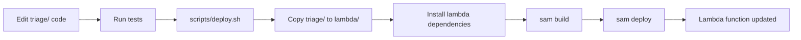

# TrIAge
# Copyright (C) 2026 StrateCode
# Licensed under the GNU Affero General Public License v3 (AGPLv3)

# Lambda Folder Explanation

## What is the `lambda/` folder?

The `lambda/` folder is the **AWS Lambda deployment package** for TrIAge. It contains everything needed to run the API on AWS Lambda.

## Why does it exist?

AWS Lambda requires all code and dependencies to be packaged together in a specific directory structure. The `lambda/` folder serves as this deployment package.

## What's inside?

```
lambda/
├── triage/                    # Copy of the main triage package
│   ├── __init__.py
│   ├── models.py
│   ├── jira_client.py
│   ├── task_classifier.py
│   ├── plan_generator.py
│   └── ...
├── boto3/                     # AWS SDK (pre-installed in Lambda)
├── pydantic/                  # Data validation library
├── requests/                  # HTTP client
├── markdown/                  # Markdown processing
├── jwt/                       # JWT authentication
├── handlers.py                # Lambda function handlers
├── authorizer.py              # JWT authorizer for API Gateway
└── requirements.txt           # Lambda-specific dependencies
```

## How is it created?

The `lambda/` folder is automatically populated during deployment:

1. **During `sam build`**:
   - SAM CLI reads `template.yaml`
   - Installs dependencies from `lambda/requirements.txt`
   - Copies the `triage/` package into `lambda/`
   - Creates the `.aws-sam/build/` directory with the complete package

2. **During `sam deploy`**:
   - Packages everything in `.aws-sam/build/`
   - Uploads to S3
   - Deploys to Lambda

## Key Files

### handlers.py

Contains the Lambda function handlers that respond to API Gateway events:

- `health_check()` - Health check endpoint
- `generate_plan()` - Generate daily plan
- `get_plan()` - Retrieve plan by date
- `approve_plan()` - Approve/reject plan
- `decompose_task()` - Decompose long-running task

### authorizer.py

JWT authorizer function that validates authentication tokens before allowing access to protected endpoints.

### requirements.txt

Lambda-specific dependencies (optimized for AWS Lambda environment):

```txt
requests>=2.31.0
markdown>=3.5.0
python-dotenv>=1.0.0
pydantic>=2.5.0
PyJWT>=2.8.0
boto3>=1.34.0
```

## Relationship with main `triage/` package

```
Project Root
├── triage/              # Main package (source of truth)
│   ├── models.py
│   ├── jira_client.py
│   └── ...
│
└── lambda/              # Deployment package
    ├── triage/          # Copy of main package (created during build)
    │   ├── models.py
    │   ├── jira_client.py
    │   └── ...
    ├── handlers.py      # Lambda-specific code
    └── ...dependencies
```

**Important**: The `triage/` folder inside `lambda/` is a **copy** created during the build process. Always edit the main `triage/` package at the root level, not the copy inside `lambda/`.

## Why not use the main package directly?

AWS Lambda requires:
1. All code in a single directory
2. All dependencies installed in the same directory
3. Specific entry points (handler functions)
4. AWS-specific code (boto3 for Secrets Manager, etc.)

The `lambda/` folder provides this isolated environment without polluting the main package with AWS-specific code.

## Build Process

```bash
# 1. Install dependencies into lambda/
cd lambda
uv pip install -r requirements.txt -t .

# 2. Copy main package
cp -r ../triage ./

# 3. Build with SAM
sam build

# 4. Deploy
sam deploy
```

This is automated by `scripts/deploy.sh`.

## What gets deployed?

When you run `sam deploy`, the following structure is uploaded to Lambda:

```
Lambda Function
├── triage/              # Your application code
├── boto3/               # AWS SDK
├── pydantic/            # Dependencies
├── requests/
├── markdown/
├── jwt/
├── handlers.py          # Entry points
└── authorizer.py        # Auth logic
```

## Local vs Lambda

| Aspect | Local Development | AWS Lambda |
|--------|------------------|------------|
| Package location | `triage/` at root | `lambda/triage/` |
| Dependencies | `.venv/` | `lambda/` directory |
| Configuration | `.env` file | AWS Secrets Manager |
| Entry point | `triage` CLI | `handlers.py` functions |
| Execution | Direct Python | API Gateway → Lambda |

## Common Questions

### Q: Can I delete the `lambda/` folder?

**A**: No, it's required for AWS deployment. However, you can delete the dependencies inside it (they'll be reinstalled during build).

### Q: Should I edit code in `lambda/triage/`?

**A**: No, always edit the main `triage/` package at the root. The copy in `lambda/` is overwritten during each build.

### Q: Why are there so many folders in `lambda/`?

**A**: These are Python dependencies (boto3, pydantic, etc.) installed directly into the `lambda/` directory so Lambda can access them.

### Q: Can I run the Lambda handlers locally?

**A**: Yes, use `sam local start-api` to run a local API Gateway + Lambda environment.

### Q: What's the difference between `lambda/requirements.txt` and root `requirements.txt`?

**A**: 
- Root `requirements.txt`: All dependencies for local development (includes testing, CLI, etc.)
- `lambda/requirements.txt`: Minimal dependencies needed for Lambda (optimized for size and cold start)

## Deployment Workflow



## Size Optimization

Lambda has a 250MB unzipped package size limit. The `lambda/requirements.txt` is kept minimal to stay within this limit:

- ✅ Essential: requests, pydantic, markdown, PyJWT
- ✅ Pre-installed: boto3 (no need to include)
- ❌ Excluded: pytest, hypothesis, development tools

## Security

- Secrets (JIRA credentials, JWT secret) are stored in AWS Secrets Manager, not in the Lambda package
- Environment variables are configured in `template.yaml`
- IAM roles grant minimal required permissions

## Troubleshooting

### "Module not found" error in Lambda

The dependency might not be installed in `lambda/`. Check `lambda/requirements.txt` and rebuild:

```bash
cd lambda
uv pip install -r requirements.txt -t .
cd ..
sam build
sam deploy
```

### Lambda package too large

Remove unnecessary dependencies from `lambda/requirements.txt` or use Lambda Layers for large libraries.

### Code changes not reflected

Ensure you're editing the main `triage/` package, not `lambda/triage/`, then redeploy:

```bash
./scripts/deploy.sh dev
```

## Summary

The `lambda/` folder is:
- ✅ Required for AWS Lambda deployment
- ✅ Automatically managed by SAM CLI
- ✅ Contains a copy of your code + dependencies
- ❌ Not for direct editing (edit main `triage/` instead)
- ❌ Not needed for local development

Think of it as the "build output" directory for AWS deployment, similar to `dist/` or `build/` in other projects.
